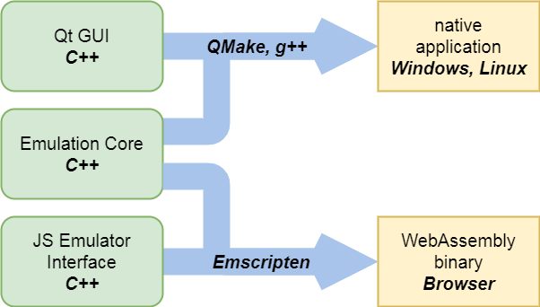

# AGE - Another Gameboy Emulator

AGE is a Gameboy emulator for Linux/Windows PCs and for your Browser.

The AGE desktop application is written in
[C++14](https://en.cppreference.com/w/cpp/14) and built with
[Qt](https://www.qt.io/).
The AGE Web Application is written in
[TypeScript](https://www.typescriptlang.org/) and makes use of
[Angular](https://angular.io) and
[WebAssembly](https://webassembly.org/)
(compiled with [Emscripten](https://emscripten.org)).

## Desktop Application Features

- run **Gameboy** and **Gameboy Color** roms
- improve **visual quality** with configurable image filters
    (custom [scale2x](https://www.scale2x.it/),
    [gaussian blur](https://en.wikipedia.org/wiki/Gaussian_blur)
    and [embossing](https://en.wikipedia.org/wiki/Image_embossing))
- improve **audio quality** with a
    [low pass filter](https://en.wikipedia.org/wiki/Low-pass_filter)
- **reduce flicker** for some Gameboy roms
- automatically store and load **savegames**
    (if supported by the respective Gameboy rom)
- configure **buttons** and **hotkeys** as you like

The AGE Desktop Application stores all settings and savegames in a subdirectory
called `.age_emulator` in the user's home directory.

## Building AGE

